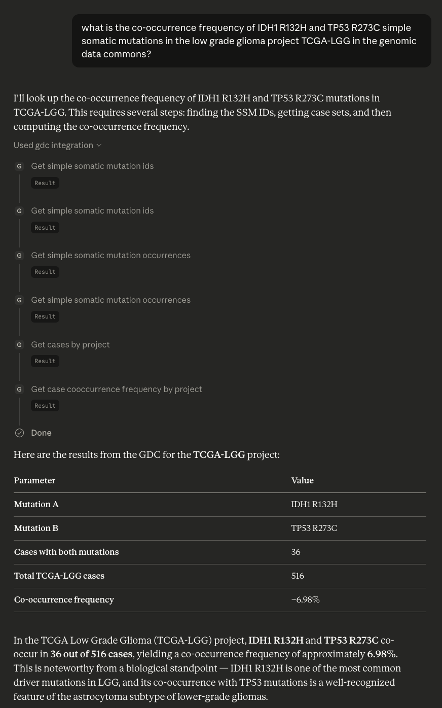
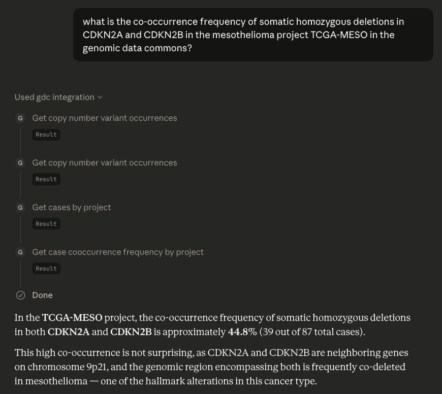

# QAG Agent Demo

This demo serves to modernize the Query Augmented Generation (QAG) framework using contemporary agentic concepts. The first iteration of QAG relied on a custom LLM to infer the intent of user queries. After categorizing the intent, a secondary model and retrieval system were used to gather the entities required to query the GDC API. Manual routing and orchestration using the intent and entities was done to construct and execute the GDC API queries. Finally, the resulting information was parsed by a tertiary LLM for final return to the user. These steps are fragile and do not scale well: the custom model to infer user intent was trained on poorly generated, templated synthetic queries for a small subset of tasks; additional tasks require manual curation of entity maps as well as custom router logic; and tasks are hard-coded and result in code duplication without sufficient modularization.

Modern agentic LLMs with well-documented MCP tools are sufficiently powerful to simplify all of these steps. Given MCP tool descriptions, an LLM agent can determine which tools are most appropriate for the given user query. Additionally, the agent can dynamically extract the entitities from the user's query and correctly prepare them in the input format required by the tools. When multiple steps of API queries are potentially necessary, the agent can dynamically plan and execute multi-round tool calls to accomplish a complex task. Yet, for simpler tasks, the modular tool design allows for direct reuse without custom logic or implementation.

## Example queries

For this demo, we test 2 example queries from the QAG paper:
* Simple Somatic Mutations:
    ```
    what is the co-occurrence frequency of IDH1 R132H and TP53 R273C simple somatic mutations in the low grade glioma project TCGA-LGG in the genomic data commons?
    ```
    * <details>
      <summary>Expand for Claude Desktop answer</summary>

      

      </details>
    * <details>
      <summary>Expand for locally-served <code>gpt-oss-120b</code> agent answer</summary>

      ```
      TODO
      ```

      </details>
* Copy Number Variants:
    ```
    what is the co-occurrence frequency of somatic homozygous deletions in CDKN2A and CDKN2B in the mesothelioma project TCGA-MESO in the genomic data commons?
    ```
    * <details>
      <summary>Expand for Claude Desktop answer</summary>

      

      </details>
    * <details>
      <summary>Expand for locally-served <code>gpt-oss-120b</code> agent answer</summary>

      ```
      TODO
      ```

      </details>

## Connect to the MCP server using Claude Desktop

At its core, this demo relies on a strong LLM and an MCP server. If you don't have access to a high-capacity GPU, you can still test out the demo by connecting the MCP server to a frontier-model provider (honestly, these resutls tend to be stronger). This section specifically details how to test out the MCP tools using Claude Desktop.
1. Download and install Claude Desktop (https://claude.com/download)
1. Download and install `uv` (https://docs.astral.sh/uv/#installation)
1. Clone this repository and setup your virtual environment:
    ```
    git clone git@github.com:StevenSong/qag-agent-demo.git
    cd qag-agent-demo
    uv venv --python 3.12.12
    uv pip install -r requirements.txt
    source .venv/bin/activate
    ```
1. Open Claude Desktop, go to Settings > Developer > Edit Config, and open the file `claude_desktop_config.json` in your favorite text editor
1. Add the following section to your JSON config file, note that you should provide absolute paths for `uv` and `qag-agent-demo`:
    ```
    "mcpServers": {
        "gdc": {
            "command": "/path/to/uv"
            "args": [
                "--directory",
                "/path/to/qag-agent-demo",
                "run",
                "server.py",
                "-t",
                "stdio"
            ]
        }
    }
    ```
1. Restart Claude Desktop (must fully close the application to reload the config)
1. Verify that the `gdc` MCP server has started by checking the enabled "Connectors" (from the main prompt UI, click the `+` sign in the lower left, Connectors submenu)
1. Try the example queries (you'll need to approve the tool usage through the UI)

## Using a locally served agent

If you have access to a high-capacity GPU (e.g. 80GB of VRAM), you can use a capable open-weight reasoning model to create an agent which queries the GDC through the MCP server. To that end, we use the following tools:
* `openai/gpt-oss-120b` as our reasoning/tool calling model
* dockerized `ollama` to serve the LLM
* `FastMCP` to define our MCP server
* `langchain` to create our agent
    * `langchain-ollama` to connect to our `ollama` instance
    * `langchain-mcp-adapters` to connect to our MCP instance

#### Setup

Clone this repo and setup your environment. We use conda below but you can alternatively use any other virtual environment manager (eg `uv`) and install directly from `requirements.txt`. If you use something other than conda, make sure to use the same python version (`3.12.12`).

```
conda create -f env.yaml
conda activate qag-agent-demo
```

#### Run Servers

Once you've setup and activated your environment, start the `ollama` and MCP servers:
```
# start the ollama server, change the GPU index as needed
docker run -d --rm --gpus='"device=0"' -v ollama:/root/.ollama -p 11434:11434 --name ollama ollama/ollama
docker exec ollama ollama run gpt-oss:120b

# start the MCP server
python server.py
```

#### Execute Queries

To execute these queries, run the agent:
```
python agent.py "<query>"
```

## Notes
* Because the entire agent orchestration is dynamic and LLM-driven, it is possible for the LLM to make mistakes. While there are observed stabilities issues with this demo (e.g. with the SSM query), these are potentially solveable using standard LLM prompting techniques (see next bullet).
* The crux of an MCP server is the quality of the tool descriptions, including the purpose of the tool and the semantics and format of the arguments. The current tool descriptions were created very quickly in a single morning. There's alot of room for improvement.
* Another observation for instability may be the model's ability to parse and pass around UUIDs. This is precisely why the demo server uses a server side cache for very long lists of case IDs that can be referenced by a single UUID, but even then, sometimes the model gets weird outputs when trying to parse/repeat UUIDs.
* This demo currently does not use structured outputs, but that should be trivial to add.
